# Floorplan2Walkthru

**Turn an architectural floor plan SVG into a navigable, editable 3D walkthrough**

A proof-of-concept exploring how far you can get with just a floorplan, using the latest AI techniques (as of 2026.05). Runs in-browser, 3D meshes take <1s to generate.

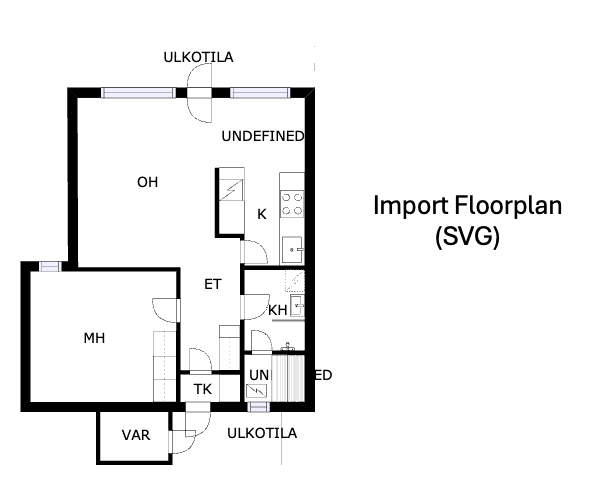

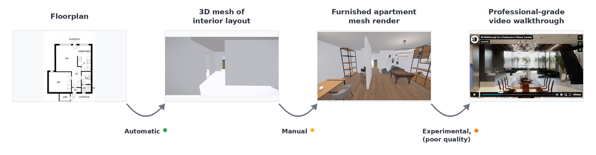

> ⚠️ **Disclaimer:** demo / PoC, vibe-coded in a few days. Contains bugs

## Contents

- [Features (working)](#features-working)
- [Limitations](#limitations)
- [Running it locally](#running-it-locally)
- [Experiments](#experiments)
  - [1. Agentic furniture placement](#1-agentic-furniture-placement)
  - [2. Live render re-styling (img2img diffusion)](#2-live-render-re-styling-img2img-diffusion)
  - [3. Gaussian splats from per-room panoramas](#3-gaussian-splats-from-per-room-panoramas)
- [Future improvement ideas](#future-improvement-ideas)
- [See also](#see-also)

## Features (working)

- **Import a floor plan SVG and walk through it in 3D.** Tested with [CubiCasa5K](https://github.com/CubiCasa/CubiCasa5k) examples.
  - 3D mesh is generated automatically in <1s.
  - Walls, windows, and doors are placed from the SVG. Geometry is to scale.
  - Live rendering in Three.js + postprocessing 
- **Furniture and interior editing.** Move, scale, rotate, search-and-replace.
  - A few dozen CC-licensed assets included (tables, couches, chairs, lamps, etc.).
  - Ceiling, door, wall, and floor texture options.
- **Walkthrough video capture.** Press `C` to record. The export bundles keypoints, the final video, and per-frame G-buffers (albedo / depth / normal / metallic / roughness) into a single zip.
- **Per-room panorama capture.** Press `P` to capture a 360° equirectangular panorama from the player's current position. One panorama per room is stored and included on save.

## Limitations

- Single-story buildings only. No stairs, no elevation changes (apartments and bungalows work; townhouses don't).
- Half-walls and railings are parsed as windows.
- Ceiling height is hardcoded at 2.2 m. Doors are 2 m tall (width is adjusted from the plan). Windows are 1 m tall, 0.8 m above the floor.
- Lots of bugs

## Running it locally

```bash
npm install
npm run dev
```

open local server (e.g. `http://localhost:5173`).

Pick a sample plan from the dropdown, click the canvas to lock the cursor, and walk around with WASD + mouse. Press `Q` for the full controls overlay.

**To use your own plan**  
Click `import` and upload an SVG compatible with [Cubicasa](https://github.com/CubiCasa/CubiCasa5k) format. Two samples are in `data/raw_cubicasa_test`

**To recreate Gaussian Splat experiment:**  
1. Move to an area in a room that has a clear view of everything and press `p` to generate an equirectangular panorama.
2. Click download. Extract zip, find the room_n_furnished.png
3. Upload to your favourite diffusion model e.g. Nano Banana 2 and prompt to change styling, lighting, furniture etc.
4. Upload the resulting panorama to the [Marble](https://marble.worldlabs.ai) model or try generating it yourself with [**Spag4D**](https://github.com/cedarconnor/SPAG4d/)

## Experiments

### 1. Agentic furniture placement

**Problem.** We can auto-generate the apartment shell, but furnishing it is still manual and tedious. If we could automate this step, the whole floorplan → walkthrough pipeline could be end-to-end.

**Approach.** Furniture lives in a `session.json` metadata file per plan (coordinates, rotation, scale) and you can ask Claude to modify it.

**Observations**  
Promising, but it needs better tooling to be reliable. Without visual feedback, Claude sometimes clips furniture through walls or misjudges scale. 

<table>
  <tr>
    <td>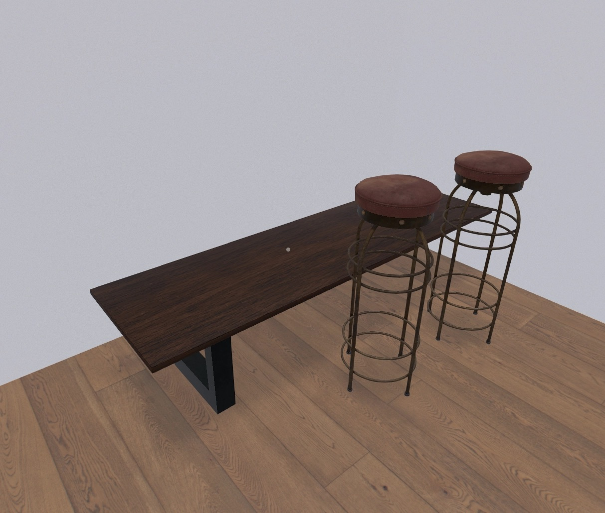</td>
    <td>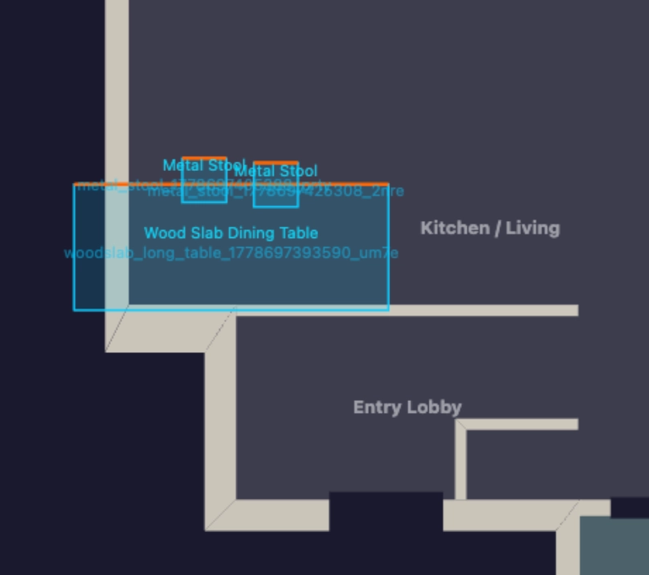</td>
  </tr>
</table>

The most obvious next step is giving the agent better spatial tools: the existing bird's-eye renderer is already wired up to be callable from an API, so the agent could see what it just placed and iterate. Hand-picked placement presets (sofa-facing-TV, bed-against-wall) would also help.

Relevant work:
- [MANSION: Multi-floor language-to-3D scene generation](https://arxiv.org/pdf/2603.11554)
- A [Worldlabs employee's project](https://github.com/neilsonnn/image-blaster) went viral on HN just as I was working on this. It generates the furniture meshes on the fly via Hunyuan-3D, and seems to work well. This avoids needing a large furniture library but costs $$.

### 2. Live render re-styling (img2img diffusion)

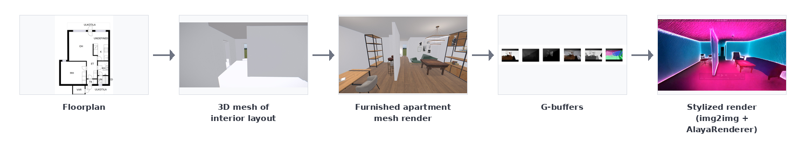

**Problem.** Three.js with postprocessing has a ceiling and looks like a video game at best. Getting closer to photorealism by hand is time-consuming and doesn't generalize across plans.

**Approach.** 
- Drive an img2img diffusion model (StreamDiffusion / [AlayaRenderer](https://huggingface.co/spaces/Brian9999/game-editing)) directly from the live render. 

- Input five G-buffers: albedo, depth, normal, metallic, roughness.

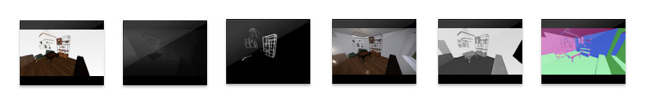

<!-- 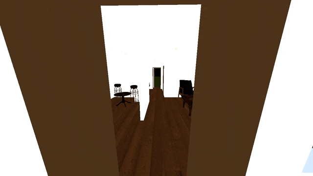 -->


<table>
  <tr>
    <td>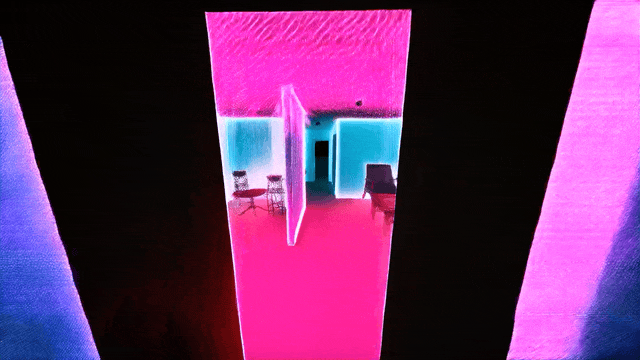</td>
    <td>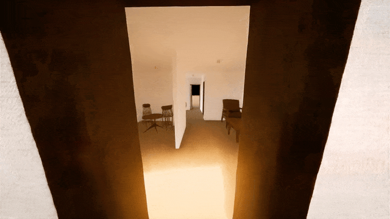</td>
  </tr>
</table>

**Observations:** 
- Difficult to achieve frame-to-frame consistency. The styled output still flickers in textures and small details. 
- The model will not substantially change the furniture, only the lighting. A custom img2img model could be used in the diffusion pipeline, but would need a lot of tuning. 

### 3. Gaussian splats from per-room panoramas

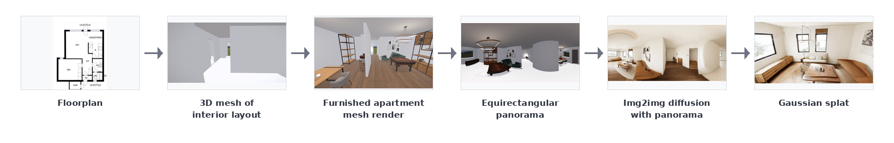

**Approach.** Capture an equirectangular panorama in each room, run it through an  img2img model to upgrade the styling, then input the result into a Gaussian splat for navigation.

- Using [**Nano Banana 2**](https://gemini.google.com) for img2img. Works really well but doesn't strictly preserve geometry. A different model could be used, conditioned on depth maps.
- Splats are generated from stylized panorama with [**WorldLabs Marble**](https://marble.worldlabs.ai). I tried [**Spag4D**](https://github.com/cedarconnor/SPAG4d/) which is an awesome project, but couldn't achieve quality, running on Mac M1.


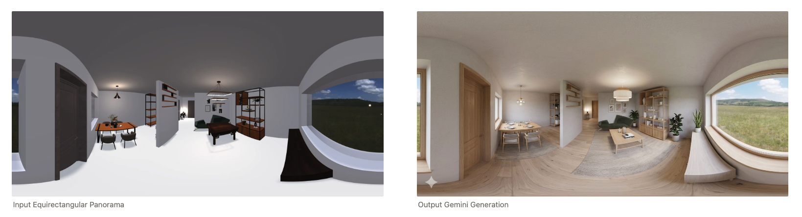

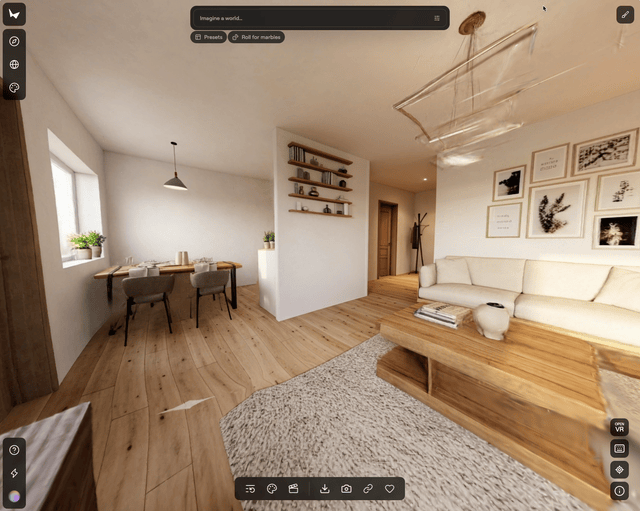

**Observations**
- Splats have difficulty handling entryways and secluded objects. We don't have a way to consistently generate multiple views using our generated furniture. This is why I decided to create one pano per room (e.g. could switch splats when crossing door boundary). 
- Distant objects may get distorted. A different projection (e.g. cubemap) might be worth trying, although Marble explicitly supports panoramas. 


## TODO

**Known issues:**
- Wall generation over-extrusion
- Bird's-eye view sometimes shows assets with the wrong rotation
- Some asset files contain multiple objects and need to be split on import

**Ideas:**
- Use Gemini and WorldLabs API to automate Splat generation
- Agentic furniture placement with better spatial tools and live preview
  - On-the-fly furniture mesh generation (image-blaster style)
- Support for more object types in the SVG schema
- Working room subdivision (so you can colour a single wall in a single room)
- Test more SVGs; explore other file formats
- Retexture / recolour individual furniture pieces
- Outdoor HDRI selector (especially: drone-altitude HDRI in a city — if you know of one, please let me know!)
- More camera options and FOV control
- Asset-uploading UI


## See also

- [world-mesh](https://mschneider456.github.io/world-mesh/) — Architecture mesh and renderings → Gaussian Splat
- [HouseCrafter](https://neu-vi.github.io/houseCrafter/) — panorama-based interior reconstruction
- [image-blaster](https://github.com/neilsonnn/image-blaster) — Image -> Mesh and Gaussian splat generation
- [CubiCasa5K](https://github.com/CubiCasa/CubiCasa5k) — floor plan dataset
